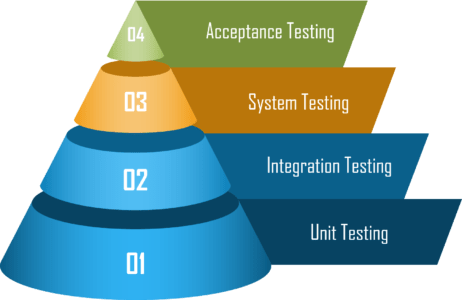

# xUnit ile Test Yazmak (.NET)
_"Software Architecture with C# 12 and .NET 8 4th Edition"_ kitabından yararlanılmıştır.
## ✅ 1. [Fact]
* Basit, parametresiz ve bağımsız test senaryoları yazmak için kullanılır.
```csharp
// Asal Sayı mı testi
[Fact]
public void IsPrime_WithPrimeNumber_ReturnsTrue() 
{
    Assert.True(MathHelper.IsPrime(7));
}
```

## ✅ 2. [Theory]
* Parametre alır. Tek bir test metodunu birden fazla veriyle test etmeni sağlar.
```csharp
// Asal Sayı mı testi ve beklenen sonuç karşılaştırması
[Theory]
[InlineData(2, true)]
[InlineData(4, false)]
public void IsPrime_ReturnsExpectedResult(int number, bool expected) 
{
    Assert.True(MathHelper.IsPrime(number), expected);
}
```
* **[InlineData]**  sabit veri kaynağı.
* **[MemberData]**  dinamik veri kaynağı.
* **[ClassData]** nesne temelli veri kaynağı.

## Testlerde AAA deseni uygulanır.
* Arrange: Test için gerekli ortam verileri ayarla.
* Act: Test edilen kodu çalıştır.
* Assert: Sonucun beklediğin gibi olup olmadığını test et.


## **İsimlendirme standartı**
_Login_With_Invalid_Password_

# ✅ xUnit ile En Popüler Assert Metotları (.NET)

Bu belgede, .NET platformunda kullanılan **xUnit** test framework'ü ile en sık kullanılan `Assert` metotları ve görevleri özetlenmiştir. Her assert türü için kısa bir açıklama ve kullanım örneği yer almaktadır.

| Metot                        | Görevi                                                   | Örnek Kod                                                              |
|-----------------------------|-----------------------------------------------------------|------------------------------------------------------------------------|
| `Assert.Equal(expected, actual)`      | İki değerin eşit olup olmadığını kontrol eder              | `Assert.Equal(5, toplam);`                                            |
| `Assert.NotEqual(notExpected, actual)`| İki değerin farklı olup olmadığını kontrol eder             | `Assert.NotEqual(10, sonuc);`                                         |
| `Assert.True(condition)`             | Koşulun `true` olmasını bekler                             | `Assert.True(kullanici.Aktif);`                                       |
| `Assert.False(condition)`            | Koşulun `false` olmasını bekler                            | `Assert.False(hataVarMi);`                                            |
| `Assert.Null(object)`               | Nesnenin `null` olup olmadığını kontrol eder               | `Assert.Null(response.Data);`                                         |
| `Assert.NotNull(object)`            | Nesnenin `null` **olmamasını** kontrol eder                | `Assert.NotNull(sonuc);`                                              |
| `Assert.Contains(expected, collection)`| Belirli bir öğenin koleksiyon içinde olup olmadığını kontrol eder | `Assert.Contains(3, sayilar);`                                |
| `Assert.Throws<TException>(() => code)`| Belirli bir exception fırlatıldığını test eder              | `Assert.Throws<DivideByZeroException>(() => bolme(10, 0));`           |
| `Assert.IsType<T>(object)`           | Nesnenin belirli bir tipte olduğunu kontrol eder           | `Assert.IsType<string>(cevap.Mesaj);`                                 |

# 🧪 Unit Testlerde Veritabanı ile Çalışma Yöntemleri

Unit testlerde mock veri ile çalışılmalıdır. Veritabanını taklit eden yapılarla çalışılmalıdır.

| Tür      | Amaç                                                                 |
|----------|----------------------------------------------------------------------|
| **Mock** | Bir metodun çağrılıp çağrılmadığını veya nasıl çağrıldığını test etmek |
| **Stub** | Sabit bir değer döndürmek (kontrollü yanıt vermek)                   |
| **Fake** | Gerçeğe yakın ama basitleştirilmiş davranış (örneğin, in-memory DB)  |
| **Dummy**| Gerekli ama testte kullanılmayan parametre sağlamak için             |

## Entegrasyon Testleri
Entegrasyon testleri de bir endpointin, bir işin bir çarkın geçerli çalışıp çalışmadığıı test eder.
Bunun için gerektiğinde HttpClient oluşturup kendi endpointimize istek göndeririz ve bir endpointin ya da yapının çalışıp çalışmadığını görürüz.

## Ortak Bir Test Verisiyle Çalışmak

### 1. IClassFixture
Bir sınıf içindeki test metodları ortak bir veriyle çalışılacaksa.

```csharp
// DI ile veriyi tek seferde alıyoruz ve tüm metodlarda kullanabiliyoruz.
public MyTestClass : IClassFixture<DbFixture>
{
    private readonly DbFixture _fixture;
    public MyTestClass(DbFixture fixture) 
    {
        _fixture = fixture;
    }
}
```

### 2. ICollectionFixture
Ortak veriyi _birçok sınıfta_ kullanacaksak.
* [CollectionDefinition("OrtakVeri1")] // Tanım
* [Collection("OrtakVeri1")] // Kullanım

```csharp
// Bu sınıf veriyi sağlayan, tanımlayan sınıf.
[CollectionDefinition("OrtakVeri1")]
public class DbCollection : ICollectionFixture<DbFixture> 
{
    // Burada veri çekme işlemleri gerçekleşsin vb.
}

// Ortak veriyi kullanan 1.sınıf
[Collection("OrtakVeri1")]
public class TestClass1 {
    DbFixture _fixture;
    public TestClass1(DbFixture fixture) 
    {
        _fixture = fixture;
    }
    // ...
}

// Ortak veriyi kullanan 2.sınıf
[Collection("OrtakVeri1")]
public class TestClass2 {
    DbFixture _fixture;
    public TestClass2(DbFixture fixture) 
    {
        _fixture = fixture;
    }
    // ...
}
```

## Örneğin bir "Giriş Yap" ekranı tasarlayalım.

#### 1. Unit Test
* E-posta doğrulama fonksiyonu düzgün çalışıyor mu?
* Şifre Uzunluğu fonksiyonu düzgün mü?

#### 2. Integration Test
* Form gönderilince backend'e doğru veri gidiyor mu?
* API doğru cevap döndürüyor mu? (HttpClient ile istek at.)

#### 3. E2E Test
* Gerçek kullanıcı gibi tüm sistemi uçtan uca test eder.
* Hatalı bilgiyle giriş yapıldığında doğru hata mesajı gösteriliyor mu?
* Selenium gibi araçlar kullanılabilir.

#### 4. Security Test
* SQL injection denemeleri engelleniyor mu?
* Çok sayıda yanlış girişte hesap kilitleniyor mu?

#### 5. Performance Test
* 1000 kişi aynı anda giriş yapmaya çalışınca sistem çöküyor mu?
* Giriş API’si yanıtı kaç saniyede veriyor?

## Kısaca Test Süreci


* **Unit Test** -> Birim fonksiyon testi.
* **Integration Test** -> Bir yapının testi, endpoint vb.
* **System Test** -> Sistemin tümünün çalışma testi.
* **Acceptance Test** -> Müşteri ile aradaki mütabakata göre gerçekleştirilen kabul testi.

